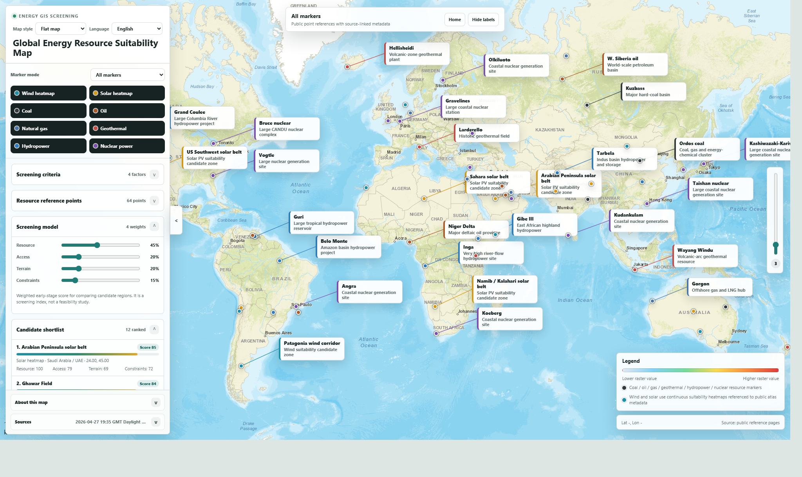
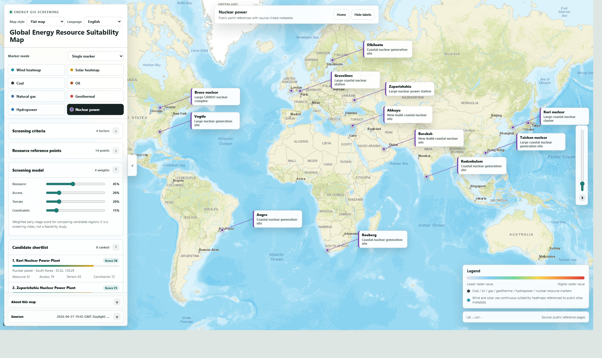
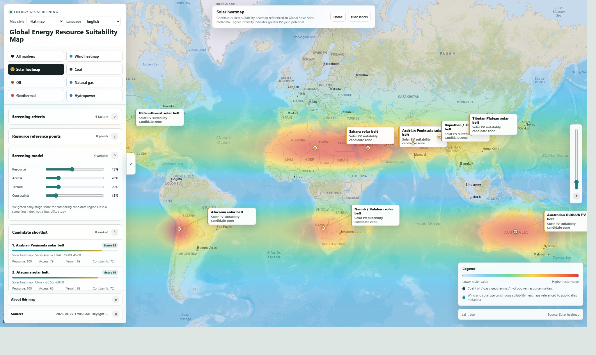
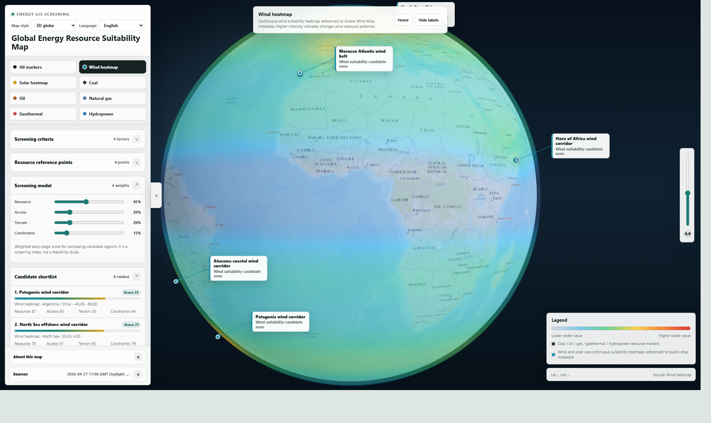

# Global Energy Resource Suitability Map

An interactive GIS screening prototype for comparing global energy-resource suitability across coal, oil, natural gas, wind, solar PV, geothermal, hydropower, and nuclear power.

The project is generated by a self-contained Python script and published as a browser-based dashboard. It is designed for early-stage consulting, portfolio screening, and public-data visualization rather than feasibility studies, reserve estimation, or engineering design.

## Live Demo

Open the published dashboard:

[https://wenyugao1.github.io/global-energy-resource-suitability-map/](https://wenyugao1.github.io/global-energy-resource-suitability-map/)

GitHub Pages serves the dashboard from `docs/index.html`.

## Local Preview

```bash
python main.py
```

Then open `energy_suitability_map.html` in a browser.

## Screenshots

### Multi-Energy Screening View



### Nuclear Layer



### Solar Heatmap With Candidate Labels



### 3D Wind Globe



## Features

- Global interactive basemap with pan and cursor-centered wheel zoom.
- Flat map and 3D globe modes.
- Energy layers for coal, oil, natural gas, wind, solar PV, geothermal, hydropower, and nuclear power.
- Marker mode selector:
  - All markers
  - Single marker
  - Multi-select markers
- Wind and solar suitability heatmaps with clickable candidate-zone labels.
- Clickable point labels with source-linked detail panels.
- Multilingual UI including English and Chinese.
- Early-stage weighted screening model with candidate ranking.
- CSV, GeoJSON, and JSON report export.
- Public-data refresh through the Python generator.

## Data Sources

The generator uses public metadata and reference pages:

- Wikipedia API for public coordinates, summaries, and source links.
- ArcGIS Living Atlas metadata for Global Wind Atlas and Global Solar Atlas layers.
- Esri World Topographic Map basemap in the generated dashboard.

The generated HTML embeds the fetched point data at build time. Online map tiles and CDN libraries are loaded by the browser when the dashboard is opened.

## Project Structure

```text
.
|-- main.py                         # Python generator and data pipeline
|-- energy_suitability_map.html      # Generated standalone dashboard
|-- docs/
|   `-- index.html                   # GitHub Pages entry point
|-- screenshots/                     # README and portfolio screenshots
|-- README.md
|-- LICENSE
`-- .gitignore
```

## Regenerate The Dashboard

The generator uses only Python standard-library modules.

```bash
python main.py
```

When network access is available, the script fetches current public metadata and writes:

```text
energy_suitability_map.html
```

To update the GitHub Pages build, regenerate the dashboard and overwrite:

```text
docs/index.html
```

Commit both generated HTML files when the public demo needs to be refreshed.

## Intended Use And Limitations

This is a public-data screening prototype. It is useful for early comparison and communication, but it does not replace licensed GIS layers, protected-area screening, land tenure, grid capacity studies, hydrology, permitting review, geotechnical work, resource assessment, or financial modeling.

Wind and solar heatmaps are browser-side screening surfaces referenced to public atlas metadata. Fossil, geothermal, hydropower, and nuclear layers use public reference points rather than exhaustive project databases or polygonal resource boundaries.
